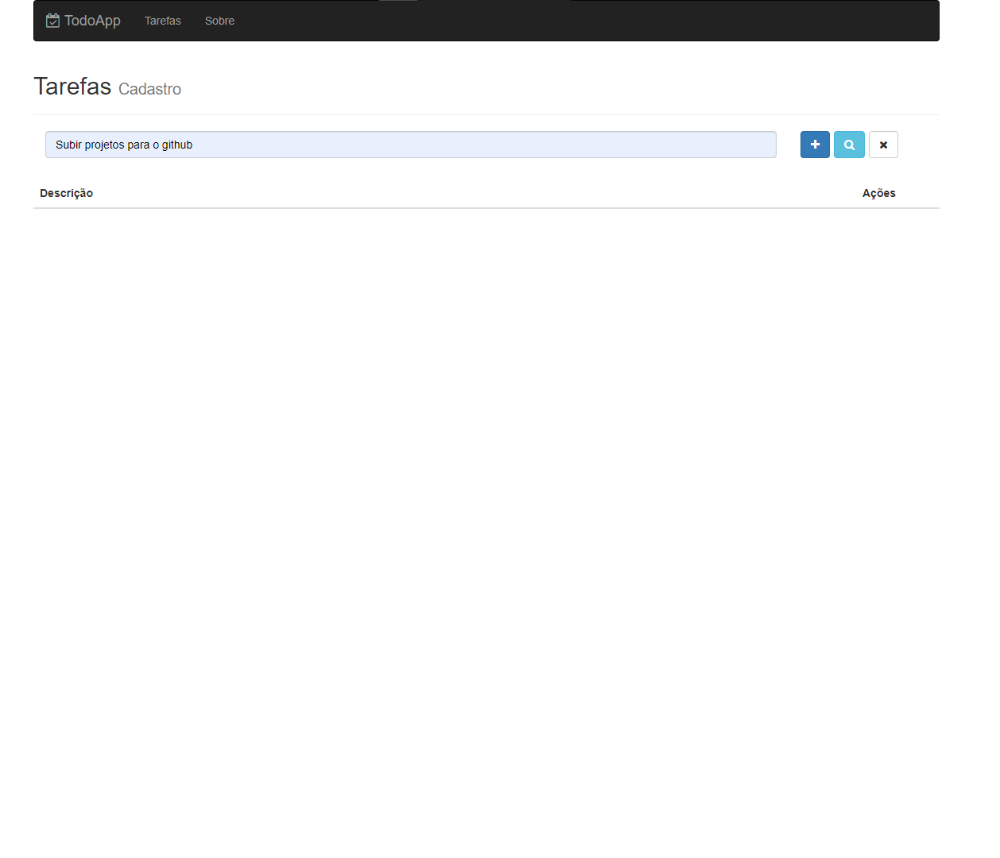

# Todo-App

Aplicativo CRUD para controle de tarefas

# Recursos

* O aplicativo foi desenvolvido com JavaScrip, CSS, HTML, React, json, redux, mongodb e express.js.

# Uso

1. Clone o repositório do GitHub.
2. Abra o projeto no seu editor de código.
3. Instale o pacote do projeto com npm install, tanto do backend quanto do front-end, com em sem redux.
4. Depois de instalado os pacotes, basta dar um npm start para iniciar o projeto no front e backend, respectivamente na porta localhost:8080 e localhost:3003.

# Créditos

Este projeto foi criado por Alaska Websites.
